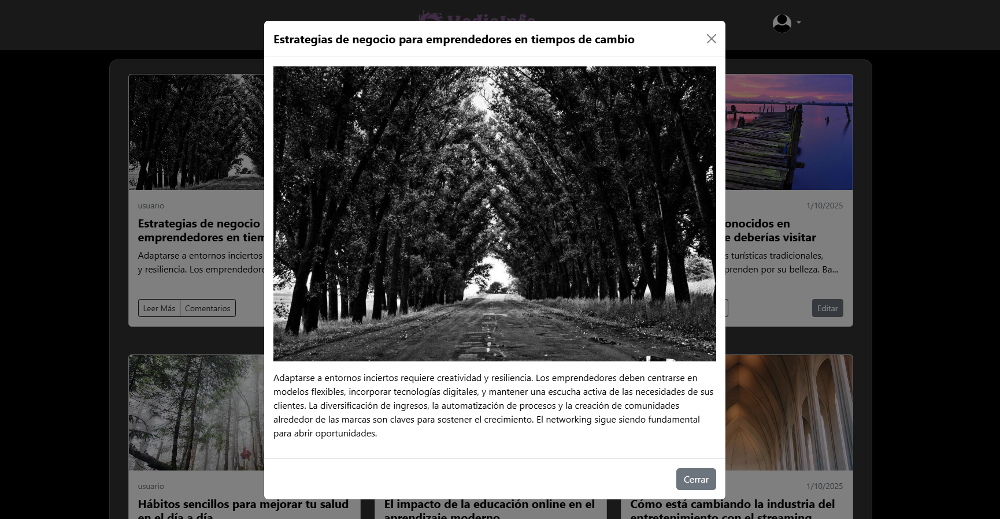
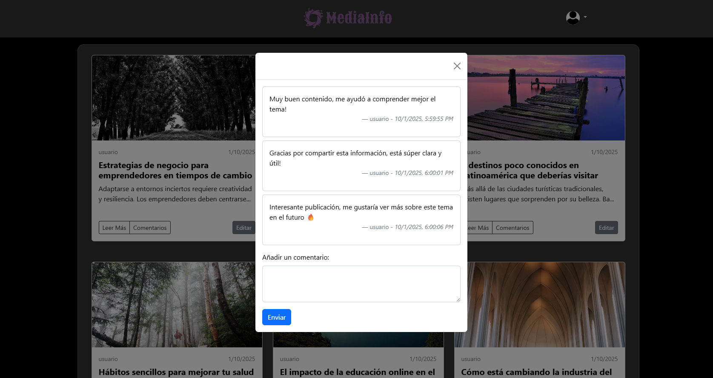
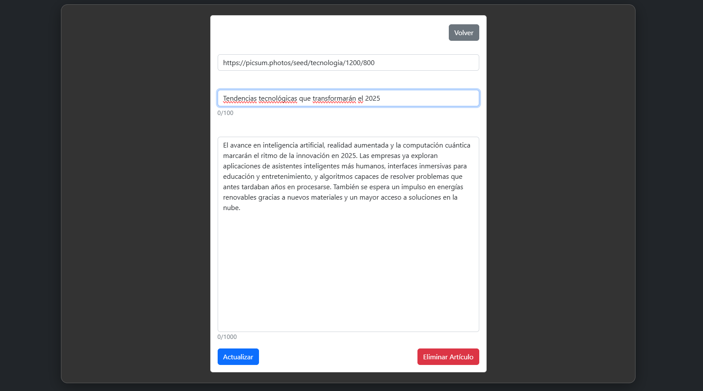
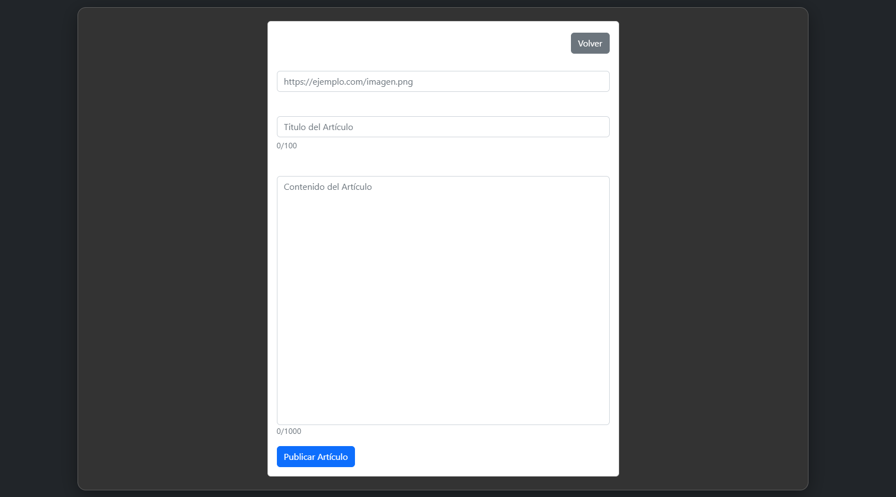

# MediaInfo

MediaInfo is a web application that allows users to create and manage articles about multimedia content. Users can register, log in, and manage their posts.

## Features

- Create, Read, Update, and Delete (CRUD) operations for articles.
- User registration and login.
- Comment on articles.
- Interactive and responsive user interface.

## Technologies Used

- HTML5
- CSS3
- JavaScript
- Firebase (Authentication and Realtime Database)

## Screenshots

_Main page with articles._

_Login form._

_Registration form._

_View of all articles._

_Form to create or edit an article._

_Modal showing the full article._

_Modal to view and add comments._

## Author

Alejandro Mejia
